# Hillel Expense Tracker

[](https://github.com/ownerofglory/hillel-expense-tracker-backend/actions/workflows/test-pipeline.yaml)

[](https://sonar.ownerofglory.com/dashboard?id=Hillel-Expense-Tracker)

This Expense Tracker project is designed to help students of **Hillel IT School** gain practical experience with core Java technologies such as `Spring Boot`, `Hibernate`, `JPA`, and web development. 

The application serves as a personal finance management tool, allowing users to log expenses, set budgets, and generate insightful reports.

## Contribute

This repository is part of the **Java Pro** course by **Hillel IT School** and is primarily intended for student contributions. While external contributions are welcome, students are encouraged to contribute as part of their learning experience. 
Please get familiar with [contributing guidelines](./CONTRIBUTE.md)

## Build 

### Prerequisites
- JDK version 23
- Maven (optional, Maven wrapper can be used insted)
- Docker (optional)
- kubectl (optional)
- MySQL (local, remote ot container)

### Execute build
```shell
    ./mvnw clean package
```

You can skipt test execution (recommened only for debugging)
```shell
    ./mvnw clean package -Dmaven.test.skipt=true
```

### Run locally

```shell
    JDBC_DB_HOST=<db_host>:<db_port> \
    JDBC_DB_NAME=<db_name> \
    JDBC_PASSWORD=<db_password> \
    JDBC_USER=<db_user> \
    MYSQL_DB_NAME=<db_name> \
    MYSQL_PASSWORD=<db_password> \
    MYSQL_USER=<db_user>\
    OPENAI_ENDPOINT=https://api.openai.com/v1/chat \
    OPENAI_KEY=<openai_key> \
    java  -jar hillel-expense-tracker-web-boot/target/hillel-expense-tracker-web-boot-1.0-SNAPSHOT.jar
```

### Build Docker image
#### Build an image
```shell
    docker build -t hillel-expense-tracker
```
#### Tag the image
```shell
    docker image tag  hillel-expense-tracker:<tag> <docker_repo>/hillel-expense-tracker:<tag>
```

#### Push the image into Docker Hub
```shell
  docker push <docker_repo>/hillel-expense-tracker:<tag>
```

## Deployment
### Docker compose
Navigate to `deploy/compose/` directory

Run
```shell
    docker compose up -d
```

### Kubernetes
Set up `K3s cluster` (singel-node Kubernetes cluster)

Install `K3S`  on your server machine
```shell
curl -sfL https://get.k3s.io | sh - 
# Check for Ready node, takes ~30 seconds 
sudo k3s kubectl get node 
```

Kube config file will be located at `/etc/rancher/k3s/config.yaml`.

Copy config file into your user's home directory and rename it to `~/.kube/config`


> Further documention regarding `K3S`: [k3s.io](https://k3s.io/)

#### Deployment diagrams

To run the application in a Kubernetes cluster you're gonna need:
- Namespace, e.g. `hillel-expense-tracker`
- Backend deployment
- Backend service to load balance the traffic between backend replicas
- Ingress

For the database (unless you're using a managed DB instance elsewhere):
- Database deployment
- Database service

Additionally, you would need following resources:
- Config maps to store config params
- Secrets for e.g. database credentials and API tokens

> Useful references:
> - Namespaces: https://kubernetes.io/docs/concepts/overview/working-with-objects/namespaces/
> - Deployment: https://kubernetes.io/docs/concepts/workloads/controllers/deployment/
> - Service: https://kubernetes.io/docs/concepts/services-networking/service/
> - Config Map: https://kubernetes.io/docs/concepts/configuration/configmap/
> - Secrets: https://kubernetes.io/docs/concepts/configuration/secret/
> - Ingress: https://kubernetes.io/docs/concepts/services-networking/ingress/

App deployment diagram in Kubernetes cluster

```mermaid
flowchart TD
    subgraph subGraph0["🔄 Backend Pod"]
        BackendPod1["📦 Pod: expense-tracker-backend-1\n(Port 8080)"]
    end
    subgraph subGraph1["🛠️ Backend deployment"]
        BackendDeploy["🚀 Deployment: expense-tracker-backend (Replicas: 1)"]
        subGraph0
    end
    subgraph subGraph2["🔄 MySQL Pod"]
        MySQLPod["🗄️ Pod: expense-tracker-mysql (Port 3306)"]
    end
    subgraph subGraph3["🗄️ Database deployment"]
        MySQLDeploy["📀 Deployment: expense-tracker-mysql"]
        subGraph2
    end
    subgraph subGraph4["☸️ K8s Cluster (Namespace: hillel-expense-tracker)"]
        Ingress
        BackendService["🔄 Service: expense-tracker-backend\n(Load Balancer)"]
        subGraph1
        MySQLService["🔄 Service: expense-tracker-mysql"]
        subGraph3
    end
    Client["🌍 External Client: web app, mobile app, desktop client"] -- "HTTP Request to example.com/tracker/api" --> Ingress["🛡️ Ingress Controller\n(example.com)"]
    Ingress --> BackendService
    BackendService -- Load Balancing --> BackendPod1
    BackendPod1 --> MySQLService
    MySQLService --> MySQLPod

```


App deployment with scaling

```mermaid
flowchart TD
 subgraph subGraph0["🔄 Backend Pods"]
        BackendPod1["📦 Pod: expense-tracker-backend-1\n(Port 8080)"]
        BackendPod2["📦 Pod: expense-tracker-backend-1\n(Port 8080)"]
        BackendPod3["📦 Pod: expense-tracker-backend-1\n(Port 8080)"]

  end
 subgraph subGraph1["🛠️ Backend deployment"]
        BackendDeploy["🚀 Deployment: expense-tracker-backend (Replicas: 3)"]
        subGraph0
  end
 subgraph subGraph2["🔄 MySQL Pod"]
        MySQLPod["🗄️ Pod: expense-tracker-mysql (Port 3306)"]
  end
 subgraph subGraph3["🗄️ Database deployment"]
        MySQLDeploy["📀 Deployment: expense-tracker-mysql"]
        subGraph2
  end
 subgraph subGraph4["☸️️ K8s Cluster (Namespace: hillel-expense-tracker)"]
        Ingress
        BackendService["🔄 Service: expense-tracker-backend\n(Load Balancer)"]
        subGraph1
        MySQLService["🔄 Service: expense-tracker-mysql"]
        subGraph3
  end
    Client["🌍 External Client: web app, mobile app, desktop client"] -- "HTTP Request to example.com/tracker/api" --> Ingress["🛡️ Ingress Controller\n(example.com)"]
    Ingress --> BackendService
    BackendService -- Load Balancing --> BackendPod1 &  BackendPod2 & BackendPod3
    BackendPod1 --> MySQLService
    BackendPod2 --> MySQLService
    BackendPod3 --> MySQLService
    MySQLService --> MySQLPod
```


### Using Helm
You can use [Helm](https://helm.sh/) to set up and deploy the project into a Kubernetes cluster

Helm Charts are located under `deploy/helm`
```shell
deploy/helm/
├── expense-tracker-backend # backend deployment and service
├── expense-tracker-config # config maps and secrets
├── expense-tracker-ingress # ingress
├── expense-tracker-mysql # database deployment and service
└── expense-tracker-mysql-storage # database persistent volume claim
```

### Using kubectl

Kubernetes manifest files are located under `/deploy/k8s`
TODO