# Deployment: Docker compose

### Prerequisites dor the PROD server machine:
- Docker
- git

## Docker compose
Navigate to `deploy/compose/` directory

#### Run locally
```shell
  cd deploy/compose
  
  docker compose up -f docker-compose-local.yaml --build -d
```
#### Run on PROD server

##### App deployment diagram with Docker compose

```mermaid
flowchart TD
    subgraph subGraph0["📦 Backend Container"]
        BackendContainer["🖥️ Container: expense-tracker-backend\n(Port 8080)"]
    end
    
    subgraph subGraph1["🗄️ MySQL Container"]
        MySQLContainer["🗄️ Container: expense-tracker-mysql\n(Port 3306)"]
    end
    
    subgraph subGraph2["🔀 Reverse Proxy (Traefik)"]
        Traefik["🌍 Traefik Router\n(example.com)"]
    end
    
    subgraph subGraph3["🖥️ Server Machine (Docker Compose)"]
        subGraph2
        subGraph0
        subGraph1
    end
    
    Client["🌍 External Client: web app, mobile app, desktop client"] -- "HTTP Request to example.com/tracker/api" --> Traefik
    Traefik -- Routes to --> BackendContainer
    BackendContainer --> MySQLContainer

```



```shell
    cd deploy/compose 
    
    docker compose up -d
```
