# Deployment: Kubernetes with Helm

### Kubernetes
#### Prerequisites dor the PROD server machine:
- git
- kubectl (installed with k3s in this example)
- Helm


### K3s Cluster setup
Set up `K3s cluster` (singel-node Kubernetes cluster)

##### 1. Install `K3S`  on your server machine

>  Documentation regarding `K3S`: [k3s.io](https://k3s.io/)


Execute following command to install `K3s` on your server and verify the installation
```shell
curl -sfL https://get.k3s.io | sh - 

# Check for Ready node, takes ~30 seconds 
sudo k3s kubectl get node 
```

Kube config file will be located at `/etc/rancher/k3s/config.yaml`.

##### 2. Copy config file into your user's home directory and rename it to `~/.kube/config`
```shell
mkdir ~/.kube
sudo cp /etc/rancher/k3s/k3s.yaml ~/.kube/config
sudo chmod 644 ~/.kube/config
```

If you don't need `HTTPS` for now **you can skip step 3** and move on to the  [next
section](#deployment)


For `HTTPS` support please proceed to the step 3

##### 3. (Recommended) Set up certificate manager (for HTTPS)
> Reference used: [Easy steps to install K3s with SSL certificate by traefik, cert manager and Let’s Encrypt](https://levelup.gitconnected.com/easy-steps-to-install-k3s-with-ssl-certificate-by-traefik-cert-manager-and-lets-encrypt-d74947fe7a8)

- Install Helm [from here](https://helm.sh/docs/intro/install/)

Or:
```shell
    curl -fsSL -o get_helm.sh https://raw.githubusercontent.com/helm/helm/main/scripts/get-helm-3
    chmod 700 get_helm.sh
    ./get_helm.sh
```
- Add helm repo
```shell
helm repo add jetstack https://charts.jetstack.io
helm repo update
```
- Install cert manager via Helm
```shell
helm install \
 cert-manager jetstack/cert-manager \
  --namespace cert-manager \
  --create-namespace \
  --set installCRDs=true
```
- Verify certificate manager
```shell
kubectl -n cert-manager get pod
```


#### Deployment

To run the application in a `Kubernetes` cluster you're gonna need:
- Namespace, e.g. `hillel-expense-tracker`
- Backend deployment
- Backend service to load balance the traffic between backend replicas
- Ingress

For the database (unless you're using a managed DB instance elsewhere):
- Database deployment
- Database service

Additionally, you would need following resources:
- Config maps to store config params
- Secrets for e.g. database credentials and API tokens

> Useful references:
> - Namespaces: https://kubernetes.io/docs/concepts/overview/working-with-objects/namespaces/
> - Deployment: https://kubernetes.io/docs/concepts/workloads/controllers/deployment/
> - Service: https://kubernetes.io/docs/concepts/services-networking/service/
> - Config Map: https://kubernetes.io/docs/concepts/configuration/configmap/
> - Secrets: https://kubernetes.io/docs/concepts/configuration/secret/
> - Ingress: https://kubernetes.io/docs/concepts/services-networking/ingress/

##### App deployment diagram in Kubernetes cluster

```mermaid
flowchart TD
    subgraph subGraph0["🔄 Backend Pod"]
        BackendPod1["📦 Pod: expense-tracker-backend-1\n(Port 8080)"]
    end
    subgraph subGraph1["🛠️ Backend deployment"]
        BackendDeploy["🚀 Deployment: expense-tracker-backend (Replicas: 1)"]
        subGraph0
    end
    subgraph subGraph2["🔄 MySQL Pod"]
        MySQLPod["🗄️ Pod: expense-tracker-mysql (Port 3306)"]
    end
    subgraph subGraph3["🗄️ Database deployment"]
        MySQLDeploy["📀 Deployment: expense-tracker-mysql"]
        subGraph2
    end
    subgraph subGraph4["☸️ K8s Cluster (Namespace: hillel-expense-tracker)"]
        Ingress
        BackendService["🔄 Service: expense-tracker-backend\n(Load Balancer)"]
        subGraph1
        MySQLService["🔄 Service: expense-tracker-mysql"]
        subGraph3
    end
    Client["🌍 External Client: web app, mobile app, desktop client"] -- "HTTP Request to example.com/tracker/api" --> Ingress["🛡️ Ingress Controller\n(example.com)"]
    Ingress --> BackendService
    BackendService -- Load Balancing --> BackendPod1
    BackendPod1 --> MySQLService
    MySQLService --> MySQLPod

```


##### App deployment with scaling

```mermaid
flowchart TD
 subgraph subGraph0["🔄 Backend Pods"]
        BackendPod1["📦 Pod: expense-tracker-backend-1\n(Port 8080)"]
        BackendPod2["📦 Pod: expense-tracker-backend-1\n(Port 8080)"]
        BackendPod3["📦 Pod: expense-tracker-backend-1\n(Port 8080)"]

  end
 subgraph subGraph1["🛠️ Backend deployment"]
        BackendDeploy["🚀 Deployment: expense-tracker-backend (Replicas: 3)"]
        subGraph0
  end
 subgraph subGraph2["🔄 MySQL Pod"]
        MySQLPod["🗄️ Pod: expense-tracker-mysql (Port 3306)"]
  end
 subgraph subGraph3["🗄️ Database deployment"]
        MySQLDeploy["📀 Deployment: expense-tracker-mysql"]
        subGraph2
  end
 subgraph subGraph4["☸️️ K8s Cluster (Namespace: hillel-expense-tracker)"]
        Ingress
        BackendService["🔄 Service: expense-tracker-backend\n(Load Balancer)"]
        subGraph1
        MySQLService["🔄 Service: expense-tracker-mysql"]
        subGraph3
  end
    Client["🌍 External Client: web app, mobile app, desktop client"] -- "HTTP Request to example.com/tracker/api" --> Ingress["🛡️ Ingress Controller\n(example.com)"]
    Ingress --> BackendService
    BackendService -- Load Balancing --> BackendPod1 &  BackendPod2 & BackendPod3
    BackendPod1 --> MySQLService
    BackendPod2 --> MySQLService
    BackendPod3 --> MySQLService
    MySQLService --> MySQLPod
```


### Deployment in kubernetes

You can chose either option for deployment
- Using `Helm` charts
- Using plain k8s manifest files with `kubectl`


#### Execute deployment using kubectl

Kubernetes manifest files are located under `/deploy/k8s`
TODO