# Build and deploy documentation

Table of contents
- [Build code and docker image](./1-build.md)
- [Deploy using docker compose](./2-deploy-compose)
- [Deploy on Kubernetes using Helm](./3-deploy-k8s-helm.md)

#### CI/CD-diagram

```mermaid
flowchart TD
    Developer["💻 Developer"] -->|Pushes Code| GitHub["📂 GitHub Repository"]
    
    subgraph subGraph1["🔍 CI - Continuous Integration"]
        GitHub -->|Triggers Workflow| CI["🔄 CI Pipeline (GitHub Actions)"]
        CI -->|Run Unit & Integration Tests| Tests["✅ Run Tests"]
        Tests -- If Success --> BuildImage["🐳 Build Docker Image"]
    end
    
    subgraph subGraph2["🚀 CD - Continuous Deployment"]
        BuildImage -->|Push to Registry| DockerHub["📦 Docker Hub"]
        DockerHub -->|Deploy Image| K8sCluster["☸️ Kubernetes Cluster"]
    end
    
    subGraph1 --> subGraph2
    
    K8sCluster -->|Runs New Version| BackendPods["📦 Updated Backend Pods"]

```
